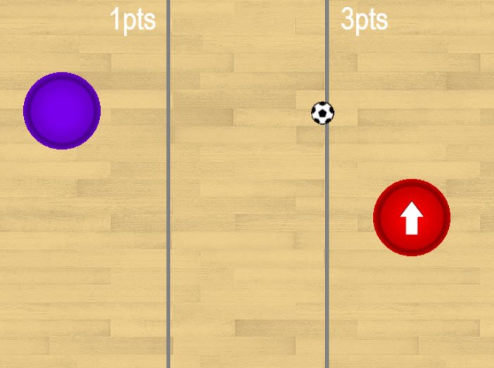
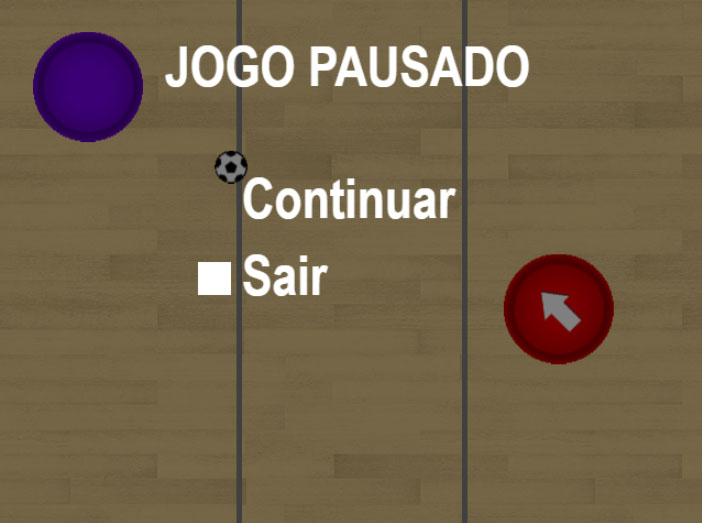

# GDS1-Java <a href="https://algol.dev" target="_blank"> </a>

Código dos 12 capítulos do livro "Game Dev Series vol.01" - versão Java.<br>
Para obter mais informações sobre o livro [clique aqui](https://algol.dev/livros/gds1/).

Cada uma das pastas contém o projeto pronto de cada um dos capítulos do livro.

## Ilustrações do jogo em execução



## Dependêcias

* ```JDK```. Você precisará ter o Kit de Desenvolvimento Java (JDK) instalado no seu computador.
* ```IDE```. Para abrir o projeto e executá-lo você precisará de um Ambiente de Desenvolvimento (IDE). Recomendamos uma das seguintes IDEs:
  - Visual Studio Code
  - Eclipse
  - NetBeans

## Como abrir o projeto e executar o jogo

Após ter instalado as dependências, abra o projeto em um Ambiente de Desenvolvimento ```Java``` e execute-o.

## Observações

Os projetos não utilizam ```game engines``` ou bibliotecas de terceiros. Todos os algoritmos (_detecção de colisões, cálculos de ângulos e deslocamento, carregamento e recorte das imagens, Inteligencia Artificial_) foram desenvolvidos em código ```Java``` padrão.

## Author

Almir David Valente Santiago [@david_v_santiago](https://linktr.ee/david.santiago)
